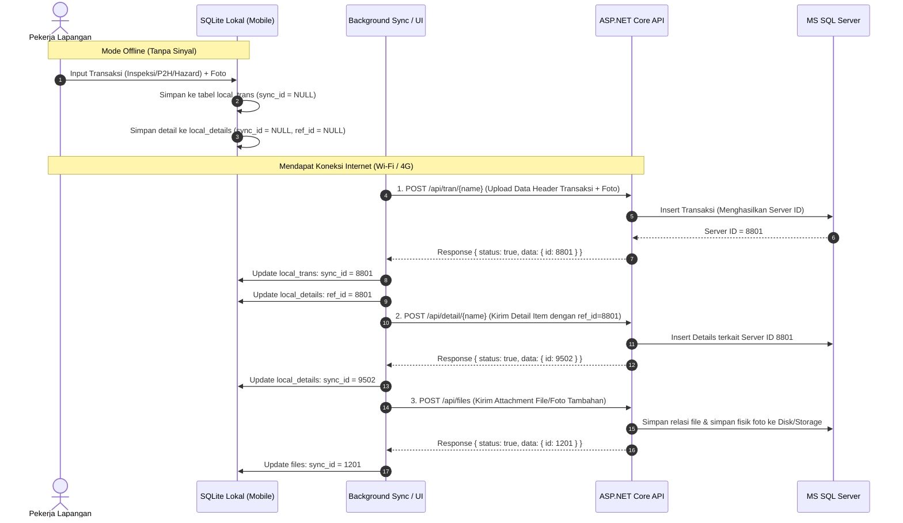

# 01 - Sistem dan Alur Kerja Indexsafe Evolution

## 1. Gambaran Umum Sistem
**Indexsafe Evolution** adalah platform digital manajemen keselamatan dan kesehatan kerja (K3 / HSE / Safety Management System) yang dirancang khusus untuk operasional industri pertambangan dan kontraktor lapangan. 

Karakteristik utama dari operasional ini adalah:
- **Area Kerja Terpencil (Remote Pit / Mining Area)**: Seringkali tidak memiliki jangkauan sinyal internet seluler atau Wi-Fi.
- **Tuntutan Kepatuhan Tinggi (Zero Incident / Compliance)**: Pemeriksaan harian (P2H alat berat, inspeksi area, pelaporan hazard) wajib dilakukan setiap shift dan tidak boleh terhenti karena masalah jaringan.
- **Transaksi Massal (Heavy Concurrent Traffic)**: Ketika ratusan pekerja berpindah dari pit tambang ke mess atau kantor (kembali mendapat sinyal Wi-Fi/GSM), seluruh data inspeksi offline di-upload secara serentak ke server.

---

## 2. Modul & Fitur Aplikasi Mobile

Aplikasi mobile berbasis **Flutter** ini memiliki modul-modul fungsional berikut:

```
                                  INDEXSAFE MOBILE
  ┌───────────────┬────────────────┬────────────────┬────────────────┐
  │   Inspeksi    │     Hazard     │      P2H       │      K3 &      │
  │  & Observasi  │   Management   │   Kendaraan    │    Induksi     │
  └───────┬───────┴────────┬───────┴────────┬───────┴────────┬───────┘
          │                │                │                │
  ┌───────┴───────┬────────┴───────┬────────┴───────┬────────┴───────┐
  │   Coaching    │     P5M &      │  Action Plan   │  Dashboard &   │
  │    Safety     │  Safety Talk   │    Follow-Up   │  QR/GPS Map    │
  └───────────────┴────────────────┴────────────────┴────────────────┘
```

1. **Autentikasi Cerdas (Online & Offline Login)**:
   - Jika ada internet: Memvalidasi kredensial ke server via `POST /api/login` (`email = company + user`), menyimpan token Bearer dan profil karyawan.
   - Jika offline (no internet): Memvalidasi NIK secara lokal terhadap tabel `employees` di SQLite yang sudah pernah tersinkronisasi sebelumnya.
2. **P2H (Pemeriksaan Pra-Operasi Harian)**:
   - Pengecekan kondisi fisik & mekanis unit kendaraan/alat berat sebelum operasi.
   - Menginput Hour Meter (HM), Kilometer (KM), Nomor Lambung, Simper, foto unit, dan checklist item kelayakan.
3. **Hazard Report (Pelaporan Bahaya)**:
   - Pelaporan potensi bahaya di lapangan (Area, Lokasi, Tingkat Bahaya/Risk Matrix, Foto/Video kondisi).
   - Mendukung pencatatan perbaikan langsung di tempat (*direct repair*) lengkap dengan foto bukti perbaikan dan catatan tindakan.
4. **Inspeksi K3 & SIMAMA**:
   - Inspeksi terencana harian/mingguan (Daily & Weekly Inspection), penugasan inspektor (hingga 5 inspektor), penanggung jawab area (PJA), dan checklist poin keselamatan.
5. **Task Observation & Safety Coaching**:
   - Pengamatan kepatuhan prosedur kerja karyawan, pencatatan deviasi, umpan balik (feedback), dan catatan pembinaan.
6. **K3 & Safety Induction**:
   - Induksi karyawan/kontraktor baru, dilengkapi tanda tangan digital (*digital signature*) penginduksi dan karyawan.
7. **P5M & Safety Talk**:
   - Dokumentasi pertemuan keselamatan 5 menit sebelum shift dimulai (topik, foto selfie/kegiatan tim, daftar hadir).
8. **Action Plan (Tindak Lanjut Temuan)**:
   - Manajemen rencana tindakan dari temuan inspeksi/hazard yang belum tuntas, penunjukan PIC & PJA, target penyelesaian, pelacakan status overdue.
9. **Scan QR & Barcode Kamera**:
   - Memindai barcode aset/lokasi/alat untuk verifikasi cepat di lapangan tanpa mengetik manual.
10. **Dashboard & Peta Interaktif**:
    - Monitoring kepatuhan K3, tracking insiden, dan visualisasi lokasi hazard menggunakan peta Leaflet dan tag koordinat GPS.

---

## 3. Arsitektur Offline-First & Alur Sinkronisasi Data

Aplikasi mobile menggunakan database lokal **SQLite** (`isafe18.db`) sebagai penyimpanan utama (*single source of truth*) di perangkat.

### Diagram Alur Sinkronisasi (Offline ke Online)



### Kunci Sukses Mode Offline:
1. **Kolom `ref_id`**: Menghubungkan detail item dengan header transaksi di server setelah header sukses dibuat di server.
2. **Kolom `sync_id`**: Menandai apakah suatu baris lokal sudah berhasil diunggah ke backend atau belum (`sync_id IS NULL`).
3. **Background Service**: Berjalan otomatis setiap 30–50 menit untuk menyapu dan mengunggah data yang belum tersinkronisasi saat perangkat terhubung ke internet.
